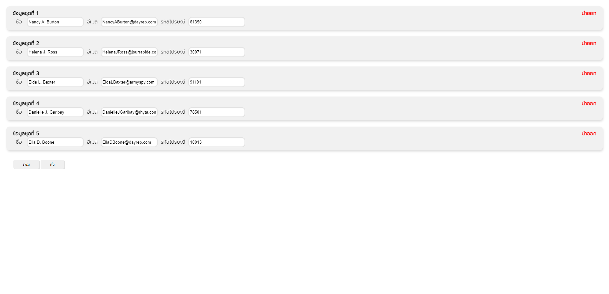

# Add or Remove React mini project
[](https://add-or-remove.vercel.app)


## Getting Started

First, run the development server:

```bash
npm run dev
# or
yarn dev
```

Open [http://localhost:9090](http://localhost:9090) with your browser to see the result.

